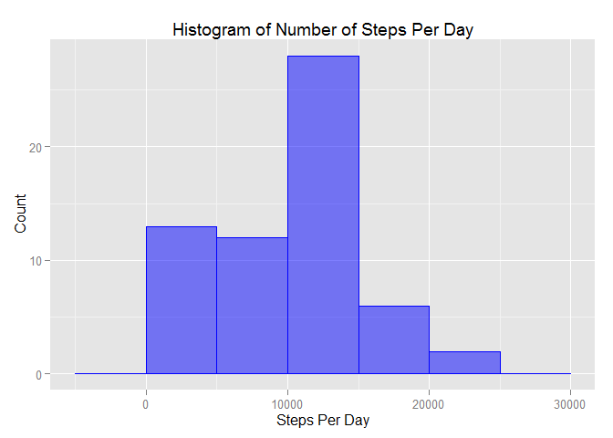
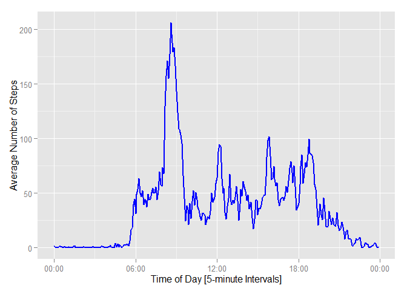
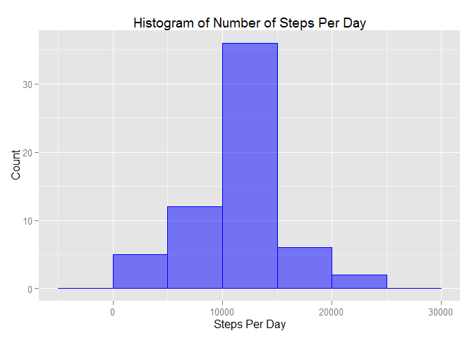
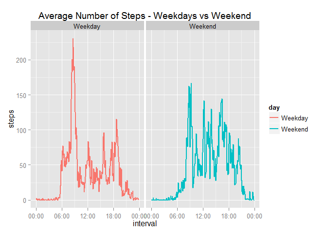

# Reproducible Research: Peer Assessment 1


## Loading and preprocessing the data

*PLATFORM INFO:
- R version 3.1.2 (2014-10-31)
- Platform: x86_64-w64-mingw32/x64 (64-bit)

First we load the data from the link provided into a data-frame 'df':


```r
library(ggplot2)
library(dplyr)

if(!file.exists("getdata-projectfiles-UCI HAR Dataset.zip")) {
        temp <- tempfile()
        download.file("http://d396qusza40orc.cloudfront.net/repdata%2Fdata%2Factivity.zip",temp)
        unzip(temp)
        unlink(temp)
}

df <- read.csv("activity.csv")
```

## What is mean total number of steps taken per day?
In this section, we construct an histogram showing the distibution of total number of steps per day. NA values are removed. We also calculate the mean and median number of steps.


```r
# Remove NA before plotting. Group by date
plot_data <- df  %>%
  group_by(date) %>%
    summarise_each(funs(sum(., na.rm = TRUE)), steps)

# Calculate an appropriate histogram binwidth using nclass.FD(),  Freedman-Diaconis
# The ggplot default is too small and not appropriate
breaks <- pretty(range(plot_data$steps, na.rm = TRUE), n = nclass.FD(plot_data$steps), min.n = 1)
bwidth <- breaks[2]-breaks[1]
# Now we construct a plot using ggplot2
g <- ggplot(plot_data, aes(steps)) + 
      geom_histogram(binwidth=bwidth,fill="blue", color="blue", alpha = 0.5) +
      labs(x="Steps Per Day", y=expression("Count")) + 
      labs(title="Histogram of Number of Steps Per Day")
g
```

 

Now we calculate the mean and median for the total steps per day:

```r
mean(plot_data$steps, na.rm = TRUE)
```

```
## [1] 9354
```

```r
median(plot_data$steps, na.rm = TRUE)
```

```
## [1] 10395
```

## What is the average daily activity pattern?
We calculate the mean steps for each five minute interval, and then place the result in a data frame. Remove NAs

```r
time_data <- df  %>%
  group_by(interval) %>%
    summarise_each(funs(mean(., na.rm = TRUE)), steps)
# Convert interval to time/date format
time_data$interval = formatC(time_data$interval/100, 2, format = "f")
time_data$interval = gsub("\\.", ":", time_data$interval)
time_data$interval = as.POSIXlt(time_data$interval, format = "%H:%M")

library(scales)
p <- ggplot(time_data, aes(x=interval, y=steps)) +
      geom_line(col= 'blue', lwd =1) +
      xlab("Time of Day [5-minute Intervals]") +
      ylab("Average Number of Steps") +
      scale_x_datetime(labels = date_format(format = "%H:%M"))
p
```

 

We now find the time of day with most number of steps is:

```r
peak = which(time_data$steps == max(time_data$steps, na.rm = TRUE))
format(time_data$interval[peak], "%H:%M")
```

```
## [1] "08:35"
```

## Imputing missing values
Let's determine the number of missing values (NA) in the steps column:

```r
sum(is.na(df$steps))
```

```
## [1] 2304
```

We calculate the mean steps taken for each interval in the dataset and will use those values to replace the NAs:


```r
avg_steps <- df  %>%
  group_by(interval) %>%
    summarise_each(funs(mean(., na.rm = TRUE)), steps)

# We now create a new data-frame 'df_fill'where the NA steps are replaced with the mean for that particular interval
df_fill = df
for (i in 1:nrow(df)) {
  if (is.na(df[i, "steps"] )) {
    indx = which(avg_steps$interval == df[i, "interval"])
    df_fill[i, "steps"] = avg_steps[indx, "steps"]
  }
}
```
Now we plot an histogram for the data with NAs replaced:

```r
plot_dataf <- df_fill  %>%
  group_by(date) %>%
    summarise_each(funs(sum), steps)

# Plot an appropriate histogram using same binwidth as before
g1 <- ggplot(plot_dataf, aes(steps)) + 
      geom_histogram(binwidth=bwidth,fill="blue", color="blue", alpha = 0.5) +
      labs(x="Steps Per Day", y=expression("Count")) + 
      labs(title="Histogram of Number of Steps Per Day")
g1
```

 

Now we calculate the mean and median for the total steps per day with the imputted data:

```r
mean(plot_dataf$steps)
```

```
## [1] 10766
```

```r
median(plot_dataf$steps)
```

```
## [1] 10766
```

As shown above, the mean and median increased once we replaced the NAs. Here's the difference:

```r
mean(plot_dataf$steps) - mean(plot_data$steps)
```

```
## [1] 1412
```

```r
median(plot_dataf$steps) - median(plot_data$steps)
```

```
## [1] 371.2
```

## Are there differences in activity patterns between weekdays and weekends?
We now create a new factor variable in the dataset with two levels - "weekday" and "weekend" indicating whether a given date is a weekday or weekend day:

```r
d = weekdays(strptime(as.character(df_fill$date), format = "%Y-%m-%d"))
d = sapply(d, function(x) {ifelse(x == "Saturday" | x == "Sunday", "Weekend", "Weekday")})
df_fill = cbind(df_fill, day = d)
```

So now we can plot average stpes per interval for weekdays and weekends:

```r
plot_data1 = df_fill %>%
  group_by(interval, day) %>%
  summarise_each(funs(mean(.,na.rm = TRUE)), steps)
# Convert interval to time/date format
plot_data1$interval = formatC(plot_data1$interval/100, 2, format = "f")
plot_data1$interval = gsub("\\.", ":",plot_data1$interval)
plot_data1$interval = as.POSIXlt(plot_data1$interval, format = "%H:%M")

g2 <- ggplot(plot_data1, aes(interval, steps, col = day)) +
  geom_line(lwd = 1) + guides(fill=FALSE) +
  facet_grid(. ~ day) +
  labs(x="interval", y= "steps") +
  labs(title="Average Number of Steps - Weekdays vs Weekend") +
  scale_x_datetime(labels = date_format(format = "%H:%M"))
plot(g2)
```

 

These plots show that there's a difference in activity patterns between weekdays and weekends. The peak of activity is higher and earlier on weekdays. Activity during the mid-day hours is higher on weekends than on weekdays.

